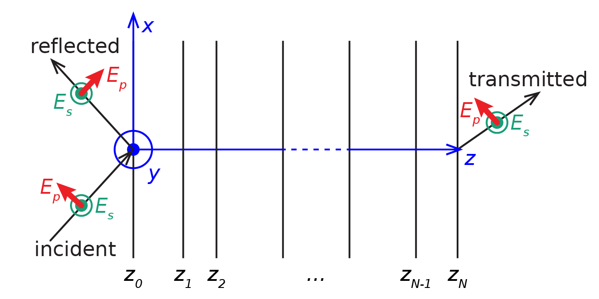
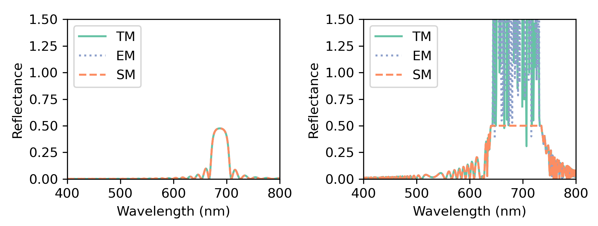

Choosing which matrix method to use
===================================

.. note::  The theory that leads to the equations presented in this section is detailed in "PyLlama: a stable and flexible Python toolkit for the electromagnetic modeling of multilayered anisotropic media" (in preparation).

The transfer matrix and the scattering matrix both link the incoming, reflected and transmitted electric fields, but their equations are built differently. The notations are displayed on Figure :numref:`schematic_Ep_Es`.

    Schematic of the electric field direction for :math:`p` and :math:`s`-polarisations.

The transfer matrix equation is:

.. math::
    \begin{bmatrix}
    E_p \: \text{transmitted} \\ E_s \: \text{transmitted} \\ 0 \\ 0
    \end{bmatrix}
    =
    T
    \begin{bmatrix}
    E_p \: \text{incident} \\ E_s \: \text{incident}  \\ E_p \: \text{reflected} \\ E_s \: \text{reflected}
    \end{bmatrix}

and the scattering matrix equation is:

.. math::
    \begin{bmatrix}
    E_p \: \text{transmitted} \\ E_s \: \text{transmitted}  \\ E_p \: \text{reflected} \\ E_s \: \text{reflected}
    \end{bmatrix}
    =
    S
    \begin{bmatrix}
    E_p \: \text{incident}  \\ E_s \: \text{incident} \\ 0 \\ 0
    \end{bmatrix}

The reflection and transmission coefficients are extracted from either of these matrix equations to obtain:

.. math::
    r_{p \: \text{to} \: p} = \frac{E_p \text{reflected}}{E_p \text{incident}}
    \quad
    r_{p \: \text{to} \: s} = \frac{E_s \text{reflected}}{E_p \text{incident}}

    r_{s \: \text{to} \: p} = \frac{E_p \text{reflected}}{E_s \text{incident}}
    \quad
    r_{s \: \text{to} \: s} = \frac{E_s \text{reflected}}{E_s \text{incident}}

and:

.. math::
    t_{p \: \text{to} \: p} = \frac{E_p \text{transmitted}}{E_p \text{incident}}
    \quad
    t_{p \: \text{to} \: s} = \frac{E_s \text{transmitted}}{E_p \text{incident}}

    t_{s \: \text{to} \: p} = \frac{E_p \text{transmitted}}{E_s \text{incident}}
    \quad
    t_{s \: \text{to} \: s} = \frac{E_s \text{transmitted}}{E_s \text{incident}}

Mathematically, both equations lead to the same result and choosing which one to use has no impact on the reflection and transmission coefficients, but numerically, differences can be observed in the robustness and in the computation time.

As an example, we built two cholesterics with a different birefringence (``chole_1`` with :math:`\Delta n = 0.05` and ``chole_2`` with :math:`\Delta n = 0.2`) and a different number of periods (20 for ``chole_1`` and 200 for ``chole_2``), and confronted the transfer and scattering matrix methods. A we can see on Figure :numref:`fig_spectra_SM_TM_EM`, the two matrix methods give the exact same results when the birefringence is low and when the number of periods is low. However, for a higher birefringence and a larger number of periods, the transfer matrix (be it calculated with the eigenvalues and eigenvectors or with the direct exponential of Berreman’s matrix) is numerically unstable.

    Reflection spectra calculated with the transfer matrix method (``TM`` and ``EM``) and the scattering matrix method (``SM``) for ``chole_1`` (left) and ``chole_2`` (right).

With the scattering matrix method (``SM``), the spectra took about 40 seconds to be calculated on a laptop, against 20 seconds for the transfer matrix method with the eigenvalue and eigenvector calculation (``TM``) and 35 seconds for the transfer matrix method with the direct exponential of Berreman’s matrix (``EM``).

The ``SM`` method always gives accurate results. However, for speed, the user may prefer using the ``TM`` transfer matrix method. The user should always check that the results calculated with ``TM`` match these calculated with ``SM`` in the most critical conditions of the user’s range of parameters (higher birefringence, larger number of periods, larger angle of incidence).

