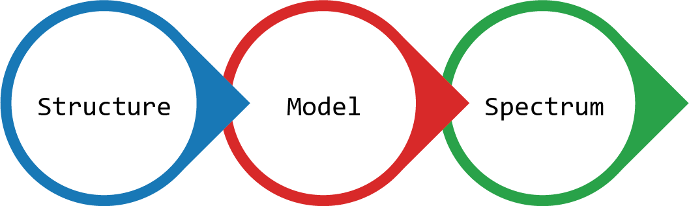

.. _rst_creating_multilayer_stack:

Creating a multilayer stack
===========================

A multilayer stack and by extension a layer is defined for given incident conditions, which are:

- the wavelength of light :math:`\lambda`, in nanometers
- the angle of incidence upon the stack :math:`\theta_{in}` defined in the entry isotropic semi-infinite medium in the :math:`(xz)` plane, in degrees or in radians
- the associated wavevector :math:`k = (k_x, k_y, k_z) = k_0 (K_x, K_y, K_z)`:

        - :math:`k_0` is the normalised wavevector (:math:`k_0 = 2 \pi / \lambda`)
        - :math:`K_x` is the :math:`x`-component of the normalised wavevector that stays constant throughout the stack (:math:`K_x = n_{entry} \sin(\theta_{in})` where :math:`n_{entry}` is the refractive index of the entry isotropic half-space)
        - :math:`K_y` is its :math:`y`-component (that equals to 0 by construction)
        - :math:`K_z` is its :math:`z`-component (:math:`K_z = n_{entry} \cos(\theta_{in})` in the entry semi-infinite isotropic medium)

There are three ways of creating a multilayer stack with ``PyLlama``:

- creating a multilayer stack from scratch with the classes ``Structure`` and ``Layer``, and working directly with classes that handle the optical calculations
- creating multilayer stacks with the abstract class ``Model`` and its children, and writing one's own child class when a different kind of stack is needed
- using the class ``Spectrum`` that provides a higher level of automation to automatically calculate reflection and transmission across a range of wavelengths

This section explains how to create a multilayer stack and the section :ref:`rst_getting_reflection_spectrum` explains how to calculate their reflectance.

From scratch: the technical way
-------------------------------

A multilayer stack consists in a series of layers sandwiched between an entry and an exit semi-infinite isotropic media. A layer is represented by the class ``Layer`` and the semi-infinite isotropic media are represented by the class ``HalfSpace``.

The entry and exit semi-infinite isotropic media are instances of the class ``HalfSpace`` and are created with:
::
    k0 = 2 * numpy.pi / wl_nm
    Kx = n_entry * numpy.sin(theta_in_rad)
    Kz_entry = n_entry * numpy.cos(theta_in_rad)
    theta_out_rad = numpy.arcsin((n_entry / n_exit) * numpy.sin(self.theta_in_rad))
    Kz_exit = n_exit * numpy.cos(theta_out_rad)
    epsilon_entry = numpy.array([[n_entry ** 2, 0, 0],
                                 [0, n_entry ** 2, 0],
                                 [0, 0, n_entry ** 2]])
    epsilon_exit = numpy.array([[n_exit ** 2, 0, 0],
                                [0, n_exit ** 2, 0],
                                [0, 0, n_exit ** 2]])
    entry = HalfSpace(epsilon_entry, Kx, Kz_entry, k0)
    exit = HalfSpace(epsilon_exit, Kx, Kz_exit, k0)

where:

- ``n_entry`` is the refractive index of the entry isotropic medium
- ``n_exit`` is the refractive index of the exit isotropic medium
- ``theta_in_rad`` is the angle of incidence in the entry isotropic medium in radians
- ``wl_nm`` is the wavelength of light, in nanometers
- ``k0`` is the wavevector magnitude
- ``Kx`` is the :math:`x`-component of the normalised wavevector that stays constant through the stack
- ``Kz_entry`` and ``Kz_exit`` are the :math:`z`-components of the normalised wavevector in the entry and exit isotropic half-spaces
- ``epsilon_entry`` and ``epsilon_exit`` are the permittivity tensors of the entry and exit isotropic half-spaces

A multilayer stack whose layers are embedded between the semi-infinite isotropic media ``entry`` and ``exit`` is then created with:
::
    Ky = 0
    Kz = n_entry * numpy.cos(theta_in_rad)
    my_stack_structure = Structure(entry, exit, Kx, Ky, Kz_entry, Kz_exit, k0)

where:

- ``Ky`` is the :math:`y`-component of the normalised wavevector that is equal to 0 throughout the stack

At this point, ``my_stack_structure`` represents two semi-infinite isotropic half-space that sandwich no layer. Layers are instances of the class ``Layer`` and are created with:
::
    my_layer = Layer(epsilon, thickness_nm, Kx, k0)

where:

- ``k0`` is the normalised wavevector
- ``Kx`` is the :math:`x`-component of the normalised wavevector
- ``epsilon`` is the permittivity tensor (3x3 Numpy array) of the layer, which can represent a material that is isotropic or anisotropic, absorbing or non-absorbing
- ``thickness_nm`` is the thickness of the layer in nanometers

The :math:`z`-component of the normalised wavevector changes inside the stack and is not defined in the ``Layer``: the partial waves will be calculated instead.

Then, the layer can be added to the stack with:
::
    my_stack_structure.add_layer(my_layer)

The content of a stack can then be accessed with:
::
    my_stack_structure.entry  # access the entry HalfSpace
    my_stack_structure.exit   # access the exit HalfSpace
    my_stack_structure.layers # access the list of Layers in the stack

The functions ``add_layers()``, ``remove_layer()`` and ``replace_layer()`` also enable the user to construct the stacks that they want.

.. note::  :math:`k_0` and :math:`K_x` stay constant throughout the stack and checks are carried out in the function ``Structure.add_layer()`` to ensure that the user only adds ``Layers`` that are compatible with the stack. The user should **not** add ``Layers`` with ``my_stack.layers.append(my_layer)`` as this may lead to impossible situations.

Lastly, the periodicity of the stack can be changed with:
::
    my_stack_structure.N_periods = number_of_periods

The ``Layers`` in the list ``my_stack.layers`` represent one periodic pattern that is repeated ``number_of_periods`` times in the stack. A multilayer stack made of ``N`` repetitions of a periodic unit consisting in ``layer_a`` with a permittivity ``eps_a`` and a thickness ``thick_a`` (in nanometers) and ``layer_b`` with a permittivity ``eps_b`` and a thickness ``thick_b`` (in nanometers) is defined with:
::
    my_stack_structure = Structure(entry, exit, Kx, Ky, Kz_entry, Kz_exit, k0)
    layer_a = Layer(eps_a, thick_a, Kx, k0)
    layer_b = Layer(eps_b, thick_b, Kx, k0)
    my_stack_structure.add_layers([layer_a, layer_b])
    my_stack_structure.N_per = N

The leftmost ``Layer`` in the list is located after the entry half-space and the rightmost ``Layer`` in the list is located before the exit half-space. The periodic pattern can include an arbitrary number of layers and we used two layers as an example.

With the ``Model`` class: the flexible way
------------------------------------------

Creating ``Layers`` from scratch to build up a multilayer stack can become constraining. Instead, pre-defined routines (``Models``) allow the user to create particular multilayer stacks such as single slabs, periodic Bragg stacks, isotropic stacks where each layer has the same optical thickness for a given wavelength, and cholesteric stacks more easily.

The class ``Model`` is a general class that gives a blueprint for all its specific children classes: ``SlabModel``, ``StackModel``, ``StackOpticalThicknessModel``, ``CholestericModel``, etc. "Giving the blueprint" means that parameters and functions that are common to all model classes are defined in the class ``Model``, and then its children classes inherit them, in addition to having their own specific parameters and functions. The user should directly use the children classes.

.. note:: Classes that give the blueprint for their children classes are usually called "abstract classes" and cannot be instanciated but it is here possible to instanciate ``Model``: it creates a stack with no layer.

A multilayer stack made of ``N`` repetitions of a periodic unit consisting in a first layer with a permittivity ``eps_a`` and a thickness ``thick_a`` (in nanometers) and a second layer with a permittivity ``eps_b`` and a thickness ``thick_b`` (in nanometers) can be represented with ``StackModel`` and is defined with:

    my_stack_model = StackModel([eps_a, eps_b], [thick_a, thick_b], n_entry, n_exit, wl_nm, theta_in_rad, N)

where the following parameters are required by all ``Models``:

- ``n_entry`` is the refractive index of the entry isotropic medium
- ``n_exit`` is the refractive index of the exit isotropic medium
- ``theta_in_rad`` is the angle of incidence in the entry isotropic medium in radians
- ``wl_nm`` is the wavelength of light, in nanometers

while the lists ``[eps_a, eps_b]`` and ``[thick_a, thick_b]`` are required specifically by ``StackModel``.

The documentation of the classes ``SlabModel``, ``StackOpticalThicknessModel`` and ``CholestericModel`` provide information on which parameters are required to create stacks with these specific classes.

With the ``Spectrum`` class: the automated way
----------------------------------------------

The ``Spectrum`` class provides a further level of automation for the user. It is meant for experimentalists who measure spectra from multilayered samples and want to quickly model their sample. The class ``Spectrum`` enables to get a full spectrum in one go and to export it for MATLAB or Python processing. The creation of a ``Spectrum`` is not more convenient than the creation of a ``Model`` but they will differ in their utilisation.

A ``Spectrum`` can be created the following way:
::
    my_stack_spec = Spectrum(wl_nm_list, model_type, model_parameters)

where:

- ``wl_nm_list`` is a list of wavelengths
- ``model_type`` is a string that describes the type of model to use
- ``model_parameters`` is a dictionary that contains all parameters needed for the model

For example, to create a ``Spectrum`` in the visible for the periodic multilayer stack described in the previous examples, the input parameters are:
::
    wl_nm_list = range(400, 800)
    model_type = "StackModel"
    model_parameters = {"eps_list": [eps_a, eps_b],
                        "thickness_nm_list": [thick_a, thick_b],
                        "n_entry": n_entry,
                        "n_exit": n_exit,
                        "theta_in_rad": theta_in_rad,
                        "N_per": N}

The documentation of the classes ``SlabModel``, ``StackOpticalThicknessModel`` and ``CholestericModel`` provide information on which parameters are required to create the appropriate dictionaries for their associated ``Spectra``.

.. note:: ``Models`` may have default parameters (for example, when the user does not specify a number of periods for ``StackModel``, the value is set to 1 automatically), which is specified in their respective documentation. This is maintained in their associated ``Spectra``: the dictionary of parameters created by the user is merged with a dictionary of default parameters.

