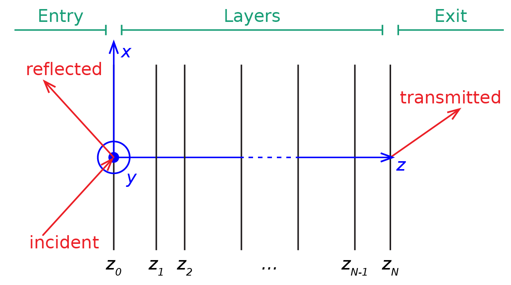

Getting started
===============

Overview
--------

PyLlama enables to calculate the reflection and transmission spectra of an arbitrary multilayer stack whose layers are made of dispersive or non-dispersive, absorbing or non absorbing, isotropic or anisotropic materials. The layers are assumed to be perpendicular to the :math:`z` axis and homogeneous and infinite in the :math:`x` and :math:`y` directions. The stack is sandwiched between an entry and an exit semi-infinite isotropic media, such as air.

    Schematic of the axes and the multilayer stack between entry and exit semi-infinite media.

We use two different matrix method approaches to calculate the reflectance and transmittance of a multilayer stack: the transfer matrix method and the scattering method. Both methods are based on the same optical principles: continuity of the electric and magnetic fields at the interfaces between the layers (referred to as "transition") and phase build-up inside the layers (referred to as "propagation"). We describe the underlying theory in our paper that the user of the code is invited to read.

Code organisation
-----------------

PyLlama is a code that can be used as a package (the user imports the code and uses the implemented classes and methods) **and** can be customised (the user writes their own routines to model specific multilayer stacks in form of children classes).

The code in ``pyllama.py`` is organised as follows:

- the three classes ``Wave``, ``Layer`` (and its child ``HalfSpace``) and ``Structure`` implement the optical calculations described in our paper. In principle, the user should not modify these classes.
- the class ``Model`` and its children contain routines that construct ``Structure`` instances through useful routines. The user should use these classes in scripts (some scripts are available on StackMat’s GitHub repository) and may also add their own children classes to the code.
- the class ``Spectrum`` provides an extra level of automation to calculate full spectra in one command and to export results in Python-compatible (Pickles) or MATLAB format. The user should use this class in scripts and may also interface it with their custom child classes of ``Model``.

How to install
--------------

``PyLlama`` requires Python 3 to run. It has been tested with Python 3.6 from Python 3.8. It also requires the following packages (other versions may work too):

- Numpy version 1.18 to 1.19
- Sympy version 1.4 to 1.6
- Scypy version 1.2 to 1.5
- Matplotlib version 3.2

The file ``pyllama.py`` must be downloaded and placed in a location that is in Python’s path. It contains the classes and function required to build multilayer stacks and calculate their reflectance. In each script, ``PyLlama`` must be imported with:
::
    import pyllama

Custom libraries may be used in interaction with the class ``Model`` to construct ``Structures``. The user should ensure that they have installed all the required libraries.

Library for cholesterics
------------------------

The file ``cholesteric.py`` is required to work with the class ``CholestericModel``, and the file ``geometry.py`` contains tools to represent cholesterics in 3D plots. If the used wishes to use the class ``CholestericModel``, they need to import the ``Cholesteric`` class with:
::
    import cholesteric

If the user does not wish to use the class ``CholestericModel``, they do not need to download ``cholesteric.py`` nor ``geometry.py``.