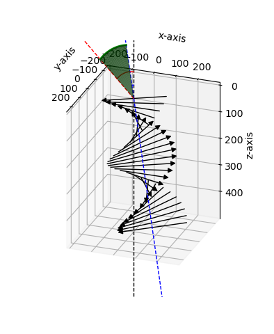
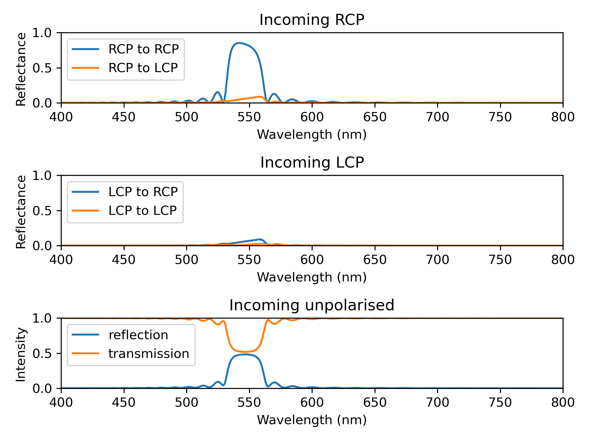

Quick cholesteric tutorial
==========================

In this section aimed at users who are not experienced in programming and/or in Python, we explain a code minimal working example to:

- create a cholesteric architecture with a chosen pitch, tilt and handedness
- obtain a 3D representation of the cholesteric architecture
- calculate the reflectance in transmittance in the circular polarisation basis for a chosen angle of incidence
- extract and plot the results in Python
- export the results for further processing in MATLAB

First, the user must import the required packages. We need ``PyLLama`` for the optical calculations, ``Cholesteric`` to create the cholesteric architecture, ``NumPy`` for basic numerical calculation and ``Matplotlib.PyPlot`` for plotting. In Python, all packages are imported in lowercaps at the beginning of the code and they are often given a shorter name (``ch`` instead of ``cholesteric`` for example).
::
    # Import the required packages
    import pyllama as ll
    import cholesteric as ch
    import numpy as np
    import matplotlib.pyplot as plt

Then, the user creates their ``Cholesteric`` object with ``ch.Cholesteric``:
::
    # Cholesteric object
    pitch_nm = 500
    tilt_rad = 10 * np.pi / 180
    chole = ch.Cholesteric(pitch360=pitch_nm,
                           tilt_rad=tilt_rad,
                           handedness=1)

The user can obtain a 3D representation of the ``Cholesteric`` object with the function ``plot_simple()``. The ``view`` parameters defines the viewing angle and the ``type`` parameters defines how the pseudolayers are represented (here, with arrows). The user should note that the :math:`x`, :math:`y` and :math:`z` axes might not have exactly the same scale.
::
    # 3D representation of the cholesteric object
    fig_3D, ax_3D = chole.plot_simple(view="classic", type="arrow")

The user can then define the incident conditions upon the cholesteric and obtain their 3D representation. When the cholesteric is tilted, the :math:`z` axis will be shifted to the helical axis for the calculations.
::
    # Incident conditions and 3D representation
    theta_in_deg = 50
    theta_in_rad = theta_in_deg * np.pi / 180
    chole.plot_add_optics(fig_3D, ax_3D, theta_in_rad)

The output is displayed on Figure :numref:`output_chole_3D`.

    3D representation of ``chole`` obtained with the functions ``plot_simple()`` and ``add_optics()``.

Then, the user can choose the optical parameters such as the average refractive index and the birefringence, and create a ``Spectrum`` object:
::
    # Optical parameters
    n_av = 1.433
    biref = 0.04
    n_e = n_av + 0.5 * biref
    n_o = n_av - 0.5 * biref
    n_entry = n_av
    n_exit = n_av
    N_per = 20
    wl_nm_list = np.arange(400, 800)

    # Creation of the spectrum
    spectrum = ll.Spectrum(wl_nm_list,
                           "CholestericModel",
                           dict(chole=chole,
                                n_e=n_e,
                                n_o=n_o,
                                n_entry=n_entry,
                                n_exit=n_exit,
                                N_per=N_per,
                                theta_in_rad=theta_in_rad))

The calculation of the reflectance and transmittance is done in one go; the parameter ``circ=True`` enables to calculate the reflectance and transmittance in the circular polarisation basis, the parameter ``method="SM"`` enables to choose the always-accurate scattering matrix method for the calculation and the parameter ``talk=True`` allows do display the calculation progress on the screen. The spectrum will take about 30 seconds to be calculated.
::
    # Calculation of the reflectance and transmittance
    spectrum.calculate_refl_trans(circ=True, method="SM", talk=True)

The results can be plotted:
::
    # Plot the spectra
    fig = plt.figure()

    ax1 = fig.add_subplot(311)
    ax1.plot(wl_nm_list, spectrum.data['R_R_to_R'], label="RCP to RCP")
    ax1.plot(wl_nm_list, spectrum.data['R_R_to_L'], label="RCP to LCP")
    plt.legend(loc=2)
    plt.xlim([400, 800])
    plt.ylim([0, 1])
    plt.xlabel('Wavelength (nm)')
    plt.ylabel('Reflectance')
    ax1.set_title('Incoming RCP')

    ax2 = fig.add_subplot(312)
    ax2.plot(wl_nm_list, spectrum.data['R_L_to_R'], label="LCP to RCP")
    ax2.plot(wl_nm_list, spectrum.data['R_L_to_L'], label="LCP to LCP")
    plt.legend(loc=2)
    plt.xlim([400, 800])
    plt.ylim([0, 1])
    plt.xlabel('Wavelength (nm)')
    plt.ylabel('Reflectance')
    ax2.set_title('Incoming LCP')

For incoming unpolarised light, the user should not forget to average the incoming RCP and incoming LCP:
::
    ax3 = fig.add_subplot(313)
    ax3.plot(wl_nm_list, 0.5 * (spectrum.data['R_R_to_R']
                                + spectrum.data['R_R_to_L']
                                + spectrum.data['R_L_to_R']
                                + spectrum.data['R_L_to_L']),
                                label="reflection")
    ax3.plot(wl_nm_list, 0.5 * (spectrum.data['T_R_to_R']
                                + spectrum.data['T_R_to_L']
                                + spectrum.data['T_L_to_R']
                                + spectrum.data['T_L_to_L']),
                                label="transmission")
    plt.legend(loc=2)
    plt.xlim([400, 800])
    plt.ylim([0, 1])
    plt.xlabel('Wavelength (nm)')
    plt.ylabel('Intensity')
    ax3.set_title('Incoming unpolarised')

The user can make the layout of the plots a bit nicer, before saving and displaying the figure (without ``plt.show()``, the plots will not be shown on the computer screen):
::
    plt.tight_layout()
    fig.savefig("script_cholesteric_example.png", dpi=300)
    plt.show()

The output is displayed on Figure :numref:`output_chole_spectra`.

    Spectra obtained with the ``Spectrum`` and ``CholestericModel``.

The results can be exported to MATLAB very simply for further processing. The parameters such as the refractive indices are also exported, as well as all the fields of the cholesteric object (such as the directors of the pseudo-layers). To export with Pickles (for Python further processing), the user should replace the extension ``.mat`` by ``.pck``.
::
    # Export the spectra to an external file
    path_out = "pyllama_cholesteric_spectrum.mat"
    spectrum.export(path_out)

